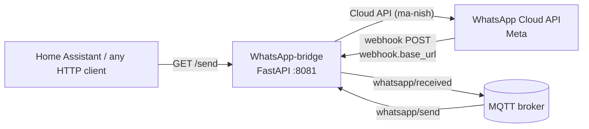

# WhatsApp-bridge

[](https://hub.docker.com/r/techblog/whatsapp-bridge)
[](LICENSE)

WhatsApp-bridge is a lightweight service written in Python with [FastAPI](https://fastapi.tiangolo.com/) and [FastAPI-MQTT](https://sabuhish.github.io/fastapi-mqtt/).
I created WhatsApp-bridge so I could send WhatsApp notifications from any application or IoT platform, using MQTT topics or HTTP calls, without writing an extension for every application or device on the network.
It talks to the official [WhatsApp Cloud API](https://developers.facebook.com/docs/whatsapp/cloud-api) (Meta) through [ma-nish](https://pypi.org/project/ma-nish/), and it can also forward incoming WhatsApp text messages to MQTT.

> **Disclaimer:** This project is not affiliated with, endorsed by, or sponsored by WhatsApp or Meta Platforms, Inc. "WhatsApp" is a trademark of its owner. The bridge uses the official WhatsApp Cloud API through an unofficial Python wrapper (ma-nish), so you need your own Meta developer app, and your use must follow Meta's and WhatsApp's terms and policies (including their pricing and messaging rules).

## Table of contents

- [Features](#features)
- [How it works](#how-it-works)
- [Components and frameworks](#components-and-frameworks)
- [Requirements](#requirements)
- [Limitations](#limitations)
- [Getting started](#getting-started)
- [Installation](#installation)
- [Configuration](#configuration)
- [API reference](#api-reference)
- [MQTT topics](#mqtt-topics)
- [Home Assistant](#home-assistant)
- [Troubleshooting](#troubleshooting)
- [Security notes](#security-notes)
- [Development](#development)
- [Contributing](#contributing)
- [License](#license)

## Features

- Send WhatsApp messages with an HTTP `GET` request (`/send`).
- Send WhatsApp messages by publishing JSON to the MQTT topic `whatsapp/send`.
- Send **template messages** (the text you send fills the template's single body variable), with a default template set in the config file and an optional per-request template and language over HTTP.
- Send **free-text messages** when no template is configured.
- Receive incoming WhatsApp **text** messages through the Cloud API webhook and publish them to the MQTT topic `whatsapp/received`.
- Webhook verification endpoint for the Meta webhook setup (`hub.verify_token` check).
- Serves a generic privacy-policy page at `/disclaimer` (see [API reference](#api-reference)).
- Multi-arch Docker image (`linux/amd64`, `linux/arm64`).

## How it works



1. On startup the bridge reads `config/config.ini`, connects to the MQTT broker (MQTT v3.1.1) and subscribes to `whatsapp/send`.
2. A message arriving over HTTP (`/send`) or MQTT (`whatsapp/send`) is sent through the WhatsApp Cloud API:
   - If a template is set (per request, or `api.template_name` in the config), it is sent as a template message and your text becomes the template's body parameter.
   - Otherwise it is sent as a plain text message.
3. When Meta calls the webhook (`POST` on `webhook.base_url`) with a new incoming **text** message, the bridge publishes the sender and the text to `whatsapp/received`.

## Components and frameworks

* [FastAPI](https://fastapi.tiangolo.com/) and [Uvicorn](https://www.uvicorn.org/)
* [FastAPI-MQTT](https://sabuhish.github.io/fastapi-mqtt/) (MQTT client, based on gmqtt)
* [ma-nish](https://pypi.org/project/ma-nish/) - unofficial Python wrapper for the [WhatsApp Cloud API](https://developers.facebook.com/docs/whatsapp/cloud-api)
* [Loguru](https://pypi.org/project/loguru/)
* [configparser](https://docs.python.org/3/library/configparser.html)

## Requirements

- A Meta developer account and a Meta **Business** app with the WhatsApp product set up, which gives you an **access token** and a **Phone Number ID** (see [Getting started](#getting-started)).
- An MQTT broker (for example Mosquitto). The bridge connects to it at startup.
- Docker (recommended), or Python to run from source (see the notes in [Build from source](#build-from-source)).
- For **incoming** messages only: a public HTTPS URL that Meta can reach, pointing at the bridge's webhook path.

## Limitations

* Free-text (non-template) messages can only be delivered after the recipient has messaged your business number (WhatsApp's customer-service window). Use template messages to start a conversation.
* Messaging costs and any free tier are set by Meta and change over time; check the [WhatsApp Business pricing](https://developers.facebook.com/docs/whatsapp/pricing) page.
* Messages are sent to a single phone number; sending to groups is not supported.
* When a template is configured, template messages must have exactly one body variable, which receives the message text.
* Incoming messages that contain `"`, `\` or a line break are published to `whatsapp/received` as invalid JSON (the payload is built by string concatenation), so JSON consumers such as Home Assistant's `payload_json` can't parse them.
* Only incoming **text** messages are forwarded to MQTT; other message types (images, locations, etc.) and delivery statuses are not.
* The MQTT topics are fixed (`whatsapp/send`, `whatsapp/received`); the `mqtt.topic` config key is currently not used.

## Getting started

### Set up a Meta app

First, follow the [instructions on this page](https://developers.facebook.com/docs/whatsapp/cloud-api/get-started) to:

* Register as a Meta developer
* Enable two-factor authentication for your account
* Create a Meta app – you need to create a **Business** app for WhatsApp

Once you've done that, go to your app and set up the WhatsApp product.

[](https://techblog.co.il/wp-content/uploads/2022/12/new-app.png "New App")

You'll be given a temporary access token and a Phone Number ID; note these down, as you'll need them later. Add your own phone number as a recipient and send yourself a test message:

[](https://techblog.co.il/wp-content/uploads/2022/12/test-number.png "Getting started")

> The temporary access token expires. For long-running use, create a permanent (system user) access token in Meta Business settings.

### Set up a message template

The test message above used the **hello_world** template. You'll need your own template for your own purposes. Go to ["Message Templates"](https://business.facebook.com/wa/manage/message-templates/) in WhatsApp Manager to build one.

In the following example, I created a template for my smart home. The template header is fixed, and so is the footer. In the body I added a variable for the dynamic text (the bridge fills this single variable with your message):

[](https://techblog.co.il/wp-content/uploads/2022/12/my-template.png "Smart Home Template")

Once you're done with the above, you're ready to send messages with this container.

### Set up incoming messages (optional)

To forward incoming messages to MQTT:

1. Set `webhook.base_url` (a path such as `/webhook`) and `webhook.token` (any secret string you choose) in `config.ini`.
2. Expose the bridge over public HTTPS (for example with a reverse proxy).
3. In your Meta app's WhatsApp **Configuration**, set the callback URL to `https://<your-public-host><webhook.base_url>` and the verify token to the value of `webhook.token`, then subscribe to the **messages** webhook field.

## Installation

The service listens on port **8081** and reads its configuration from `/app/config/config.ini` inside the container. On first start, if that file doesn't exist, an empty template is copied there; fill it in (see [Configuration](#configuration)) and restart the container.

### Docker Compose

```yaml
version: "3.6"
services:
  whatsapp-bridge:
    image: techblog/whatsapp-bridge
    container_name: whatsapp-bridge
    restart: always
    ports:
      - 8081:8081
    environment:
      - LOG_LEVEL=DEBUG
    volumes:
      - ./wa-bridge:/app/config
```

```bash
docker compose up -d
```

### Docker run

```bash
docker run -d \
  --name whatsapp-bridge \
  --restart always \
  -p 8081:8081 \
  -e LOG_LEVEL=INFO \
  -v "$(pwd)/wa-bridge:/app/config" \
  techblog/whatsapp-bridge:latest
```

### Published images

| Registry | Image | Tags | Platforms |
|---|---|---|---|
| Docker Hub | `techblog/whatsapp-bridge` | `latest`, `2.0.1`, `2.0.0`, `1.0.0` | `linux/amd64`, `linux/arm64` |

`latest` currently points to `2.0.1`. The version in the [`VERSION`](VERSION) file (`2.1.1`) has not been published to Docker Hub yet, and there are no GitHub releases or git tags. A GHCR workflow exists (see [Development](#development)), but no public image is available on `ghcr.io` at the moment.

### Build from source

```bash
git clone https://github.com/t0mer/whatsapp-bridge.git
cd whatsapp-bridge
pip install -r requirements.txt
cd app
mkdir -p config
cp config.ini config/config.ini   # then edit config/config.ini
LOG_LEVEL=INFO uvicorn app:app --host 0.0.0.0 --port 8081
```

Notes:

- Run the app from the `app/` directory: the config path (`config/config.ini`) and the templates directory are relative to the working directory.
- Always set `LOG_LEVEL`; the code has no default for it.
- Use **Python 3.9–3.11**: `urllib3>=2.6.3` in `requirements.txt` needs Python 3.9 or newer, and the config loader uses `ConfigParser.readfp`, which was removed in Python 3.12.
- `jinja2` and `uvicorn` are not listed in `requirements.txt` directly; they are installed as dependencies of `ma-nish`. `jinja2` is required at startup, because the templates for `/disclaimer` are set up when the app is imported.
- `fastapi-mqtt` is not pinned. The code uses `FastMQTT.init_app()`, which still exists in fastapi-mqtt 2.2.0 but relies on FastAPI's deprecated `on_event` hooks, so you may see deprecation warnings.

You can also build the image yourself:

```bash
docker build -t whatsapp-bridge .
```

> **Known issue:** building the image from the current source fails. The base image `techblog/fastapi:latest` is Ubuntu 20.04 with Python 3.8, and `urllib3>=2.6.3` in `requirements.txt` needs Python 3.9 or newer, so `pip install` fails. The same failure affects the Docker Build workflow, which is likely why version `2.1.1` has not been published. Use the published images, or run from source with Python 3.9–3.11.

## Configuration

### config.ini

All keys must be present in the file (the bridge reads each of them at startup). Values are read as-is; there are no defaults.

```ini
[Whatsapp]
api.token=<your-cloud-api-access-token>
api.phone_id=<your-phone-number-id>
api.template_name=<default-template-name>
api.template_language=<template-language-code, e.g. en_US>
webhook.token=<your-webhook-verify-token>
webhook.base_url=/webhook


[MQTT]
mqtt.host=<broker-host>
mqtt.port=1883
mqtt.username=<mqtt-username>
mqtt.password=<mqtt-password>
mqtt.topic=
```

| Section | Key | Required | Description |
|---|---|---|---|
| `Whatsapp` | `api.token` | Yes | WhatsApp Cloud API access token from your Meta app. |
| `Whatsapp` | `api.phone_id` | Yes | Phone Number ID of the sending number (from the Meta app's WhatsApp setup page). |
| `Whatsapp` | `api.template_name` | No (key must exist) | Default template used when a request doesn't name one. If empty and the request has no template, a free-text message is sent. |
| `Whatsapp` | `api.template_language` | When a template is used without a per-request `language` | Language code of the default template (for example `en_US`). Used when a request doesn't set `language`. An empty value is sent to Meta as-is, and the message is rejected. |
| `Whatsapp` | `webhook.token` | For incoming messages | Verify token that Meta must send as `hub.verify_token` during webhook verification. |
| `Whatsapp` | `webhook.base_url` | Yes | Path of the webhook endpoint (for example `/webhook`). It is registered as a route, so it must start with `/` even if you don't use incoming messages. |
| `MQTT` | `mqtt.host` | Yes | MQTT broker host name or IP address. |
| `MQTT` | `mqtt.port` | Yes | MQTT broker port (for example `1883`). |
| `MQTT` | `mqtt.username` | No (key must exist) | MQTT username; leave empty if the broker doesn't require authentication. |
| `MQTT` | `mqtt.password` | No (key must exist) | MQTT password. |
| `MQTT` | `mqtt.topic` | No (key must exist) | Not used by the current code; the topics are fixed (see [MQTT topics](#mqtt-topics)). |

### Environment variables

| Variable | Default | Description |
|---|---|---|
| `LOG_LEVEL` | `DEBUG` in the Docker image; no default when running from source | Loguru log level: `TRACE`, `DEBUG`, `INFO`, `SUCCESS`, `WARNING`, `ERROR`, `CRITICAL`. |

### Docker details

| Item | Value |
|---|---|
| Base image | `techblog/fastapi:latest` (Ubuntu 20.04, Python 3.8) |
| Port | `8081` (Uvicorn, `--log-level error`) |
| Config volume | `/app/config` (holds `config.ini`) |

## API reference

The HTTP server listens on port `8081`. There is no authentication on any endpoint (see [Security notes](#security-notes)). FastAPI's interactive docs are available at `/docs`; only `/send` appears there.

| Method | Path | Purpose |
|---|---|---|
| `GET` | `/send` | Send a WhatsApp message. |
| `GET` | `<webhook.base_url>` | Meta webhook verification. |
| `POST` | `<webhook.base_url>` | Meta webhook for incoming messages; forwards text messages to MQTT. |
| `GET` | `/disclaimer` | Generic privacy-policy HTML page. |

### `GET /send`

Query parameters:

| Parameter | Required | Description |
|---|---|---|
| `phone` | Yes | Recipient phone number in international format, digits only (for example `972501234567`). |
| `message` | Yes | Message text. With a template, this fills the template's body variable. |
| `template` | No | Template name. Defaults to `api.template_name`. |
| `language` | No | Template language code. Defaults to `api.template_language`. |

```bash
# Send using the default template from config.ini (or free text if none is set)
curl -G "http://localhost:8081/send" \
  --data-urlencode "phone=972501234567" \
  --data-urlencode "message=The washing machine has finished"

# Send using a specific template
curl -G "http://localhost:8081/send" \
  --data-urlencode "phone=972501234567" \
  --data-urlencode "message=Front door opened" \
  --data-urlencode "template=smart_home" \
  --data-urlencode "language=en_US"
```

The response is always HTTP 200:

- `"ok"` means the request was handed to the Cloud API. It is returned **even when Meta rejects the message**: ma-nish returns Meta's JSON response and logs the failure at `INFO` level, so check the logs to confirm delivery.
- If the bridge itself throws an error, the response is still 200, with a serialized exception as the body (usually `{}`). The error is logged at `ERROR` level.

### Webhook verification: `GET <webhook.base_url>`

Meta calls this when you save the callback URL. If `hub.mode=subscribe`, `hub.challenge` is present and `hub.verify_token` matches `webhook.token`, the bridge returns the challenge value.

```bash
curl "http://localhost:8081/webhook?hub.mode=subscribe&hub.challenge=12345&hub.verify_token=<your-webhook-verify-token>"
# 12345
```

### Incoming messages: `POST <webhook.base_url>`

Receives the Cloud API webhook payload. For a new incoming **text** message, the bridge publishes it to `whatsapp/received`; everything else is ignored. The response is always `"ok"`.

### `GET /disclaimer`

Returns a generic privacy-policy page (`app/templates/disclaimer.html`). It is generic boilerplate (it refers to a "Website Operator" and to "Telegram username"), so review and adapt it before you give it to Meta as your app's privacy policy URL.

## MQTT topics

| Topic | Direction | Payload | Description |
|---|---|---|---|
| `whatsapp/send` | Subscribed (MQTT → WhatsApp) | `{"phone": "972501234567", "message": "Text"}` | Sends `message` to `phone`, using the default template from the config if one is set, otherwise as free text. |
| `whatsapp/received` | Published (WhatsApp → MQTT) | `{"sender": "972501234567", "message": "Text"}` | An incoming WhatsApp text message received through the webhook. The payload is built by string concatenation, so a message containing `"`, `\` or a line break produces invalid JSON. |

Example:

```bash
mosquitto_pub -h <broker-host> -u <mqtt-username> -P <mqtt-password> \
  -t whatsapp/send \
  -m '{"phone":"972501234567","message":"WhatsApp message"}'
```

## Home Assistant

### Sending with the RESTful notify platform

You can send WhatsApp messages with a REST notification by adding the following to your `configuration.yaml`. The notify platform sends a `GET` request with `message` and the `data` fields as query parameters:

```yaml
notify:
  - name: WhatsApp
    platform: rest
    resource: http://<whatsapp-bridge-ip>:8081/send
    data:
      phone: "972501234567" # enter your phone number here
```

In the example above, the message is sent with the default template from the config file. To send the notification with a different template, add the template name and language to the `data` section:

```yaml
notify:
  - name: WhatsApp
    platform: rest
    resource: http://<whatsapp-bridge-ip>:8081/send
    data:
      phone: "972501234567" # enter your phone number here
      template: smart_home # enter the template name here
      language: en_US # enter the template's language here
```

Now you can test the notification using the actions (services) under **Developer tools**:

[](https://techblog.co.il/wp-content/uploads/2023/01/HA-Developer-tools-for-WA.png "HA-Developer-tools-for-WA")

### Sending over MQTT

```yaml
action: mqtt.publish
data:
  topic: whatsapp/send
  payload: '{"phone": "972501234567", "message": "Front door opened"}'
```

### Reacting to incoming messages

Add this to `automations.yaml`:

```yaml
- alias: WhatsApp message received
  triggers:
    - trigger: mqtt
      topic: whatsapp/received
  actions:
    - action: persistent_notification.create
      data:
        title: "WhatsApp from {{ trigger.payload_json.sender }}"
        message: "{{ trigger.payload_json.message }}"
```

Messages containing `"`, `\` or a line break arrive as invalid JSON, and `trigger.payload_json` is then empty (see [Limitations](#limitations)).

## Troubleshooting

- **The container exits or keeps restarting right after the first start.** The config file was just created from the empty template. Fill in `wa-bridge/config.ini` (on the host) and restart. Every key must exist, `mqtt.port` must be a number, and `webhook.base_url` must start with `/`.
- **`NoOptionError` / `NoSectionError` at startup.** A key or section is missing from `config.ini`. Copy the full template from [Configuration](#configuration).
- **MQTT messages to `whatsapp/send` are ignored.** The payload must be valid JSON with the keys `phone` and `message` (not `recipient`). A bad payload does not produce a clear error line in the bridge's log (the error handler itself fails). Instead, look for a missing `Sending message to:` line (with `LOG_LEVEL=DEBUG`) or a Python traceback in the container logs.
- **`payload_json` is empty for some incoming messages.** Messages containing `"`, `\` or a line break are published as invalid JSON; see [Limitations](#limitations).
- **Messages aren't delivered, but the bridge says `ok`.** `ok` doesn't mean Meta accepted the message; Meta's error is logged at `INFO` level. Free-text messages are only delivered inside WhatsApp's customer-service window; use a template. Also check that the template name and language match an approved template with one body variable, and that the access token hasn't expired.
- **Every message is sent as a template.** When `api.template_name` is set, both `/send` and MQTT always use a template. Clear it to send free text.
- **Meta webhook verification fails.** The verify token in Meta must equal `webhook.token`, and the callback URL must end with `webhook.base_url` and be reachable over public HTTPS.
- **Running from source fails at startup.** Set `LOG_LEVEL`, run from the `app/` directory, and see the notes in [Build from source](#build-from-source).

## Security notes

- The HTTP API has **no authentication**. Anyone who can reach port 8081 can send WhatsApp messages from your number. Don't expose it to the internet; keep it on a trusted network, or put it behind a reverse proxy with authentication.
- If you use incoming messages, expose **only** the webhook path publicly, over HTTPS, and use a long random `webhook.token`. Incoming webhook `POST` requests are not signature-verified by the bridge.
- The MQTT connection has no TLS option. Use broker authentication (username/password) and keep the broker on a trusted network; anyone who can publish to `whatsapp/send` can send messages.
- `config.ini` contains your Cloud API token and MQTT credentials in plain text. Restrict access to the config directory and never commit it.
- Recipient phone numbers are written to the logs at `INFO` level (by ma-nish) and at `DEBUG` level (by the bridge). Use `LOG_LEVEL=WARNING` or higher to keep them out of the logs.

## Development

Project layout:

```
app/
  app.py            # FastAPI app, HTTP routes, MQTT handlers, send logic
  confighandler.py  # loads config/config.ini (copies config.ini if missing)
  config.ini        # empty configuration template
  templates/
    disclaimer.html # privacy-policy page served at /disclaimer
Dockerfile
docker-compose.yaml
requirements.txt
VERSION             # image version used by the Docker Hub workflow
```

GitHub Actions workflows:

| Workflow | File | Trigger | Publishes |
|---|---|---|---|
| Docker Build | `.github/workflows/docker-image.yml` | Manual (`workflow_dispatch`), or after a workflow named `Create Release` completes | `techblog/whatsapp-bridge:latest` and `techblog/whatsapp-bridge:<VERSION>` on Docker Hub, for `linux/amd64` and `linux/arm64` |
| Publish to GHCR | `.github/workflows/publish-ghcr.yml` | Manual (`workflow_dispatch`, optional `tag` input, default `latest`) | `ghcr.io/t0mer/whatsapp-bridge:<tag>` and `:latest`, for `linux/amd64`, `linux/arm64` and `linux/arm/v7` |

There is no `Create Release` workflow in this repository, so Docker Hub builds are started manually. Both workflows currently fail at the `pip install` step (see the known issue under [Build from source](#build-from-source)). There are no automated tests.

## Contributing

Issues and pull requests are welcome. Please keep changes focused, describe what you changed and why, and never include real tokens, phone numbers or broker addresses in commits.

## License

This project is licensed under the [Apache License 2.0](LICENSE).
